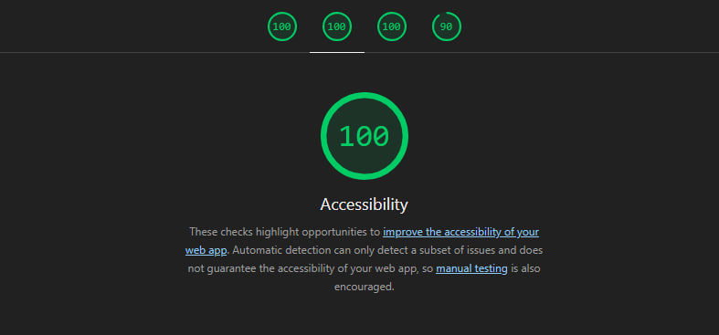

# Todo list Application

A modern, high-performance Todo List application built with React, TypeScript, and Zustand, featuring excellent accessibility and cross-browser compatibility.


## 🚀 Features

+ **Add, edit and complete tasks** with intuitive user interface
+ **Persistent data storage** using browser's local storage
+ **Fully responsive design** that works on all device sizes
+ **Cross-browser compatible** (Chrome, Firefox, Safari, Edge)
+ **Exceptional accessibility** with keyboard navigation and screen reader support
+ **Clean UI** with transitions

## 🏆 Perfect accessibility score

This application has achieved a perfect 100/100 score in Lighthouse Accessibility audits



## 🛠️ Technology Stack

+ **React 18** - Modern React with hooks and functional components
+ **Typescript** - Type-safe development experience
+ **Zustand** - Lightweight state management solution
+ **Vite** - Fast build tool and development server
+ **SCSS** - Advanced CSS with variables, mixins, and nesting
+ **ESLint & Prettier** Code quality and formatting

## 📦 Installation

1. Clone the repository:
```bash
git clone git@github.com:execute-e/todo-react-ts.git
cd todo-react-ts
```
2. Install dependencies:
```bash
npm i
```
3. Start the development server:
```bash
npm run dev
```
4. Open your browser and navigate to http://localhost:5173

---
<br>
Built with ❤️ using React, TypeScript, Zustand, SCSS, and Vite.